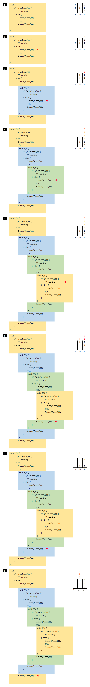

## ミニ課題: 再帰処理を追ってみよう（時間: 20 分）

再帰処理の流れを追う練習として、基本情報技術者試験の問題を解いてみましょう。

問題の内容は、** スタックに対して再帰呼び出しで Pop と Shift を繰り返すコード** です。

「スタック」が分からない場合は、検索ワード「 [データ構造 スタック](https://www.google.com/search?q=データ構造+スタック) 」で調べてください。

基本情報技術者試験の平成 31 年春期 午前問 6 の問題を引用します。

基本情報技術者平成 31 年春期 午前問 6  
https://www.fe-siken.com/kakomon/31_haru/q6.html

変数 A, B, C はいずれも、スタックのデータ構造です。各変数とも、あらかじめ「1」「2」「3」がスタックされています。

この状態を Java のコードにすると、以下のようになります。

```java title=src/RecursiveStack.java
import java.util.ArrayDeque;
import java.util.Deque;
import java.util.HashMap;
import java.util.Map;

public class RecursiveStack {

    static Deque<Integer> A = new ArrayDeque<>();
    static Deque<Integer> B = new ArrayDeque<>();
    static Deque<Integer> C = new ArrayDeque<>();

    public static void main(String[] args) {

        RecursiveStack app = new RecursiveStack();
        app.fill();

        app.print();
    }

    void fill() {
        for (int i = 1; i <= 3; i++) {
            A.push(i);
            B.push(i);
            C.push(i);
        }
    }

    private void print() {
        Map<String, Deque<Integer>> stackMap = new HashMap<>();
        stackMap.put("A", A);
        stackMap.put("B", B);
        stackMap.put("C", C);
        this.print(stackMap);
    }

    private void print(Map<String, Deque<Integer>> stackMap) {
        stackMap.forEach((k, v) -> {
            System.out.printf("%s=", k);
            for (int element : v) {
                System.out.print(element + ", ");
            }
            System.out.println();
        });
    }
}
```

最初の状態がどうなっているか、実行してみましょう。

```
A=3, 2, 1,
B=3, 2, 1,
C=3, 2, 1,
```

それでは出題された問題となっている再帰メソッドを見てみます。

### 再帰メソッド

```java
void f() {
        if (A.isEmpty()) {
            // nothing
        } else {
            C.push(A.pop());
            f();
            B.push(C.pop());
        }
    }
```

ここでやっと課題です。この `f()` メソッドの実行後、A, B, C の変数の中身はどうなるか？処理を追ってみてください。

一度、答えを出してから、以下の解答・解説を見てください。

## 解答・解説

再帰呼び出しの動きを表すと、以下のイメージになります。

<details>
<summary>解答・解説を読む（クリックで開く）</summary>




</details>


## 完全版のソースコード

スタックの再帰メソッドについての完全版ソースコードは以下の通りです。

https://github.com/fs5013-furi-sutao/java-bootcamp-answers/blob/main/02.entry/41.recursive-method/src/RecursiveStack.java

処理を実際に追いたい場合は、デバッグで動かしてみてください。
