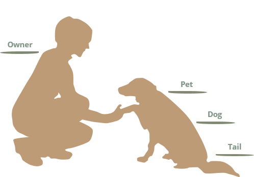

## 学習

### 関連・集約・構成が何を指すかを知る

クラスの関係性をあらわす用語として、次の 3 つがあります。

- 関連（Association）
- 集約（Aggregation）
- 構成（Composition）

関連、集約、コンポジションがそれぞれ何かを Web で調べてください。
検索キーワードは、「 [java 集約 コンポジション](https://www.google.com/search?q=java+集約+コンポジション) 」です。
3 種類ぐらい説明記事やサンプルコードを読んで、「関連」「集約」「コンポジション」がそれぞれ何かをつかみましょう。

### イメージで理解する

関連、集約、構成が何に当たるか、イメージで示します。



ここには、次の関係があります。

- 飼い主はペットに餌をやる、ペットは飼い主にお手をする（Association）
- 尻尾は犬と猫の両方の一部である（Aggregation/Composition）
- 猫は一種のペットである（継承/一般化）

### 関連、集約、構成の違いは何ですか？

集約と構成は関連の一部です。

集約は構成を包含し、関連は集約を包含しています。つまり、集約と構成は、関連の特定のケースであることを意味します。


あるクラスの集約オブジェクトと構成オブジェクトの両方で、別のクラスのオブジェクトを「所有」します。

しかし、次のような微妙な違いがあります。

### 集約と構成の違い

#### 1. 集約

集約とは、子が親から独立して存在できる関係を意味します。例：教室（親）と学生（子）。
教室を削除しても、生徒はまだ存在します。

#### 2. 構成

構成とは、子が親から独立して存在できない関係を意味します。例：家（親）と部屋（子）。
部屋は家とは別に存在しません。

## 練習問題 01: 集約 Aggregation（時間: 20 分）

研究所が学科を、学科が院生を集約する（Aggregation）ように次の 3 つのクラスを作成しなさい

なお、3 つのクラスを以下の ComputerScienceCulture クラスで実行すると、実行結果の通りになること

1. GraduateStudent クラス
2. Department クラス
3. Institute クラス

### ComputerScienceCulture.java

```java
package advanced.aggregation;

import java.util.ArrayList;
import java.util.List;

import advanced.aggregation.entity.Department;
import advanced.aggregation.entity.GraduateStudent;
import advanced.aggregation.entity.Institute;

/**
 * コンピュータ工学系を扱うクラス
 * 集約 Aggregation の概念を説明する Java プログラム
 */
class ComputerScienceCulture {
    public static void main(String[] args) {
        GraduateStudent[] students = {
            new GraduateStudent("山本一郎", 1, "CSE: Computer Science Engineering"),
            new GraduateStudent("山下花子", 2, "CSE: Computer Science Engineering"),
            new GraduateStudent("山口恵美", 1, "EE: Electrical Engineering"),
            new GraduateStudent("山田太郎", 2, "EE: Electrical Engineering"),
        };

        // making a List of
        // CSE Students.
        List<GraduateStudent> cseStudents = new ArrayList<GraduateStudent>();
        cseStudents.add(students[0]);
        cseStudents.add(students[1]);

        // making a List of
        // EE Students
        List<GraduateStudent> eeStudents = new ArrayList<GraduateStudent>();
        eeStudents.add(students[2]);
        eeStudents.add(students[3]);

        Department cse = new Department("CSE", cseStudents);
        Department ee = new Department("EE", eeStudents);

        List<Department> departments = new ArrayList<Department>();
        departments.add(cse);
        departments.add(ee);

        Institute institute = new Institute(
                "CSNT: 名工大情報理工学系研究所", departments
            );

        System.out.print("研究所に所属する生徒数: ");
        System.out.print(institute.getTotalStudentsInInstitute());
    }
}
```

### ComputerScienceCulture.java の実行結果

```console
研究所に所属する生徒数: 4
```

## 解答例

https://github.com/fs5013-furi-sutao/java-bootcamp-answers/blob/main/05.advanced/07.association-aggregation-composition/src/advanced/aggregation

## 練習問題 02: 構成 Composition（時間: 20 分）

本が図書館を構成する（Composition）ように次の 2 つのクラスを作成しなさい

なお、2 つのクラスを以下の Librarian クラスで実行すると、実行結果の通りになること

1. Book クラス
2. Library クラス

### Librarian.java

```java
package advanced.aggregation.composition;

import java.util.ArrayList;
import java.util.List;

import advanced.aggregation.composition.entity.Book;
import advanced.aggregation.composition.entity.Library;

/**
 * 図書館司書を扱うクラス
 * 構成 Composition の概念を説明する Java プログラム
 */
public class Librarian {
    public static void main(String[] args) {

        Book[] booksArray = {
            new Book("Effective Java", "Joshua Bloch"),
            new Book("Refactoring", "Martin Fowler"),
            new Book("Clean Coder", "Robert C. Martin"),
            new Book("Domain-Driven Design", "Eric Evans"),
        };

        List<Book> books = new ArrayList<>();
        books.add(booksArray[0]);
        books.add(booksArray[2]);
        books.add(booksArray[3]);

        Library library = new Library(books);

        List<Book> allBooksInLibrary = library.getAllBooksInLibrary();

        for (Book book : allBooksInLibrary) {
            book.showDetails();
        }
    }
}
```

### Librarian.java の実行結果

```console
タイトル: Effective Java      , 著者: Joshua Bloch
タイトル: Clean Coder         , 著者: Robert C. Martin
タイトル: Domain-Driven Design, 著者: Eric Evans
```

## 解答例

https://github.com/fs5013-furi-sutao/java-bootcamp-answers/blob/main/05.advanced/07.association-aggregation-composition/src/advanced/composition
